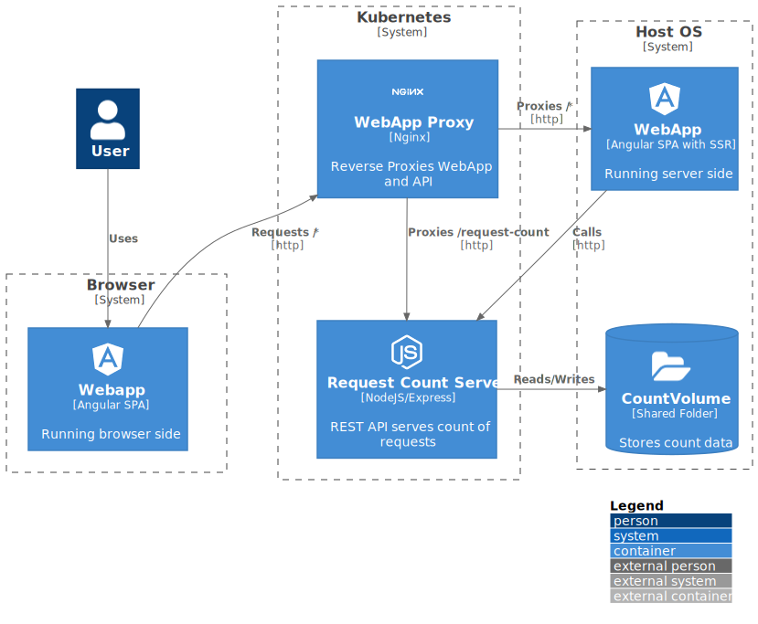

# Local Kubernetes Development Blog
This repo contains the projects, blog post, notes, and other assets for the Local Kubernetes Development blog post.

## Prerequisites
* Docker Desktop with Kubernetes enabled
* A namespace on Kubernetes called "test-app": `kubectl create namespace test-app`
* Helm
* Node.js 15
* Make

Note: Currently this works on MacOS because of the persistent volume given. To work on Windows some alterations to the persistent volume may need to be made.

## About

This repo contains three projects:
1. The [request-count-server](./request-count-server) that showcases an app running in kubernetes that will persist data on the hostOS, can be rebuilt and rerun, and can be accessed outside the cluster.
1. The [webapp-prox](./webapp-proxy) that showcases an app running in kubernetes that can communicate with apps running on the host OS
1. The [webapp](./webapp) that showcases a locally running app with communications to apps running on kubernetes.

Here is a brief architectural representation of these applications:

## Working with the Local Environment
### The Request-count-server

1. Change into the [request-count-server](./request-count-server) directory.
1. Build and install: `make build install`
1. Test the application: `curl http://localhost:30001/request-count`
1. See the log output: `kubectl logs deploy/request-count-server -n test-app`
1. Make a change to the application. Eg, add `console.log(newCount);` after line 24 of index.js. Then rebuild and restart: `make build restart`. Test the application again: `curl http://localhost:30001/request-count` and see the new log changes: `kubectl logs deploy/request-count-server -n test-app` (It may take a minute to become apparent as the old pod(s) have to terminate first).
1. Look at the file `/Users/Shared/request-counter-volume/countfile.txt`. Notice that it is storing the count data.

### The Webapp

1. Change into the [webapp](./webapp) directory.
1. Create a file called `.env` with these contents: `API_SERVER=http://localhost:30001`

#### Without Server Side Rendering
1. Start the SPA for local development: `npm ci && npm start`
1. Visit `http://localhost:4200` in the browser. Notice where it says "Count is x", and how the count changes each time the page is refreshed.

#### With Server Side Rendering

1. Stop the app if it is running.
1. Run the app for SSR: `npm ci && npm run dev:ssr`
1. Visit `http://localhost:4200` in the browser. Notice it now says "Count is" without a number, and there may be erros in the browsers console such as "SyntaxError: Unexpected token < in JSON at position 0". This is because it we need a reverse proxy to reroute API calls to `/request-count` to the request count API Server.
1. Leave this running for the webapp-proxy.   

### The Webapp-proxy

1. Change into the [webapp-proxy](./webapp-proxy) directory.
1. Build and install: `make build install`
1. Visit `http://localhost:30002` in the browser. Notice it says "Count is x" again and it increments on page refresh. Notice that it is incrementing by 2 this time: Once for the server side rendering call, and once for the browser side rendering call (because we're not using transfer state).